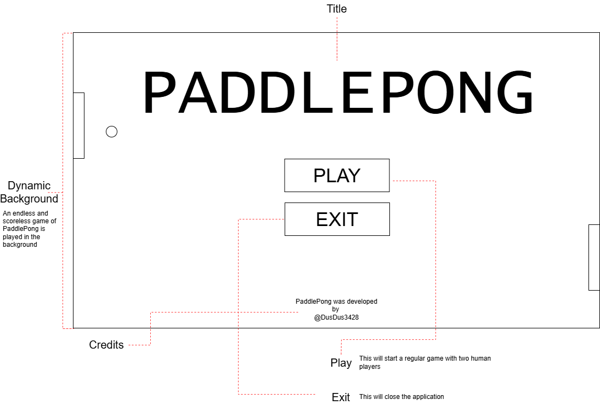
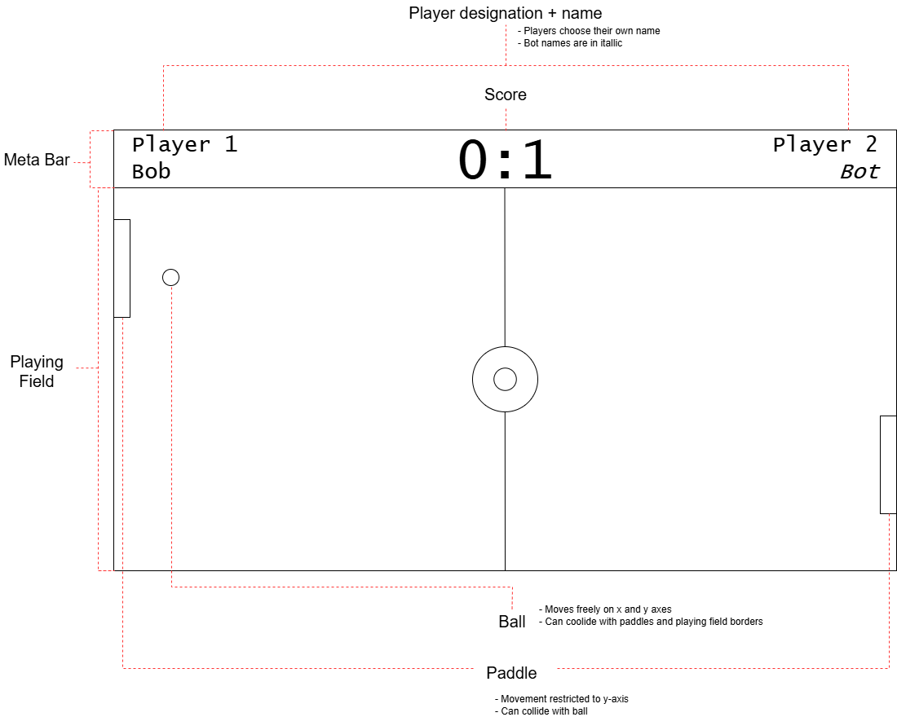

# Documentation
This document outline some technical documentation to PaddlePong, an arcade classic, developed in Unreal Engine 5!

## Wireframes
There are currently two wireframes that exist-one for the start menu and one for the main level.

### Start Menu

This wireframe depicts the start menu for PaddlePong. The menu is quite simplistic in nature. 
In the background, an endless and scoreless game of PaddlePong is played. This is made possible by using two bots that just play against each other non-stop. When the user clicks on PLAY, a new game is started with two human players. When they click on EXIT, the application ends.

### Main Level

This wireframe depicts the main level for PaddlePong. The level is devided into two sections, the meta bar and the playing field. 
The meta bar contains the meta information for the game, which comprises the player names and the score. The player names also signify the players' side of the playing field. Names of bot players are in italic.
The playing field is again divided into two sides, one for each player. Each player controls the paddle on their end and it can only move on the y-axis (up or down). The ball moves from side to side on the playing field. When it collides with a paddle or the top or bottom walls, it bounces off an heads into the opposite direction, taking the collision angle into account. When it collides with one of the walls on either side, the player on the other side socres a point and the next round begins. 

